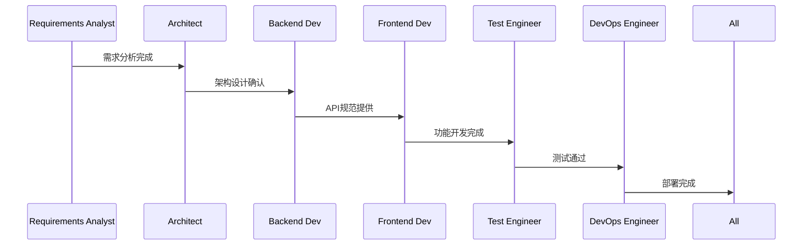
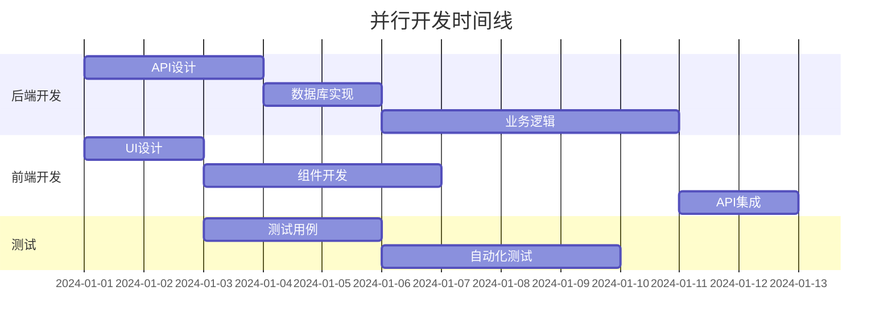

# 代理间通信协议

## Overview
定义不同subagent之间的通信机制、协作模式和知识共享协议，确保高效协作和信息同步。

## 通信层次

### 1. 实时通信层
```markdown
## 即时消息
- **场景**: 紧急问题、快速决策、实时协作
- **渠道**: 专用Slack频道、Teams群组、Discord服务器
- **格式**: 结构化消息 + @提及
- **响应时间**: 紧急1小时内，普通4小时内

## 语音/视频会议
- **场景**: 复杂讨论、设计评审、头脑风暴
- **工具**: Zoom、Google Meet、Teams
- **时长**: 15-60分钟
- **纪要**: 自动记录并共享
```

### 2. 异步通信层
```markdown
## 邮件通信
- **场景**: 正式通知、决策记录、外部协作
- **模板**: 标准化邮件格式
- **归档**: 项目知识库
- **追踪**: 邮件标签和规则

## 文档协作
- **平台**: Confluence、Notion、GitLab Wiki
- **类型**: 设计文档、会议纪要、决策记录
- **版本**: 版本控制和变更历史
- **通知**: 重要更新通知机制
```

### 3. 结构化数据交换
```yaml
API接口:
  purpose: "系统间数据交换"
  format: "JSON/REST"
  authentication: "API Keys"
  rate_limit: "1000 req/hour"

消息队列:
  purpose: "异步事件通知"
  protocol: "Redis Pub/Sub"
  events:
    - "feature_completed"
    - "bug_reported"
    - "deployment_ready"
```

## 协作模式

### 1. 串行协作模式


### 2. 并行协作模式


### 3. 跨职能协作模式
```yaml
cross_functional_teams:
  feature_team:
    members:
      - "Backend Developer (Lead)"
      - "Frontend Developer"
      - "Test Engineer"
      - "Requirements Analyst"
    focus: "Feature delivery"
    duration: "Sprint length"

  platform_team:
    members:
      - "DevOps Engineer (Lead)"
      - "Architect"
      - "Security Specialist"
    focus: "Platform stability"
    duration: "Ongoing"
```

## 消息格式标准

### 1. 状态更新消息
```json
{
  "type": "status_update",
  "from": "backend_developer",
  "to": ["architect", "test_engineer"],
  "timestamp": "2024-01-15T10:30:00Z",
  "project": "personal-ai-assistant",
  "component": "user_service",
  "status": {
    "state": "in_progress",
    "progress": 65,
    "completed_tasks": ["API设计", "数据库迁移"],
    "current_task": "认证实现",
    "blockers": [],
    "estimated_completion": "2024-01-18"
  },
  "attachments": [
    {
      "type": "documentation",
      "url": "/docs/user-service-api.md"
    }
  ]
}
```

### 2. 问题报告消息
```json
{
  "type": "issue_report",
  "from": "test_engineer",
  "to": ["backend_developer", "frontend_developer"],
  "priority": "high",
  "issue": {
    "id": "BUG-123",
    "title": "用户登录失败",
    "description": "特定条件下用户无法登录",
    "severity": "high",
    "reproduction_steps": [
      "1. 打开登录页面",
      "2. 输入特殊字符密码",
      "3. 点击登录"
    ],
    "environment": {
      "platform": "web",
      "browser": "Chrome 120",
      "os": "Windows 11"
    },
    "attachments": [
      {
        "type": "screenshot",
        "url": "/screenshots/BUG-123.png"
      },
      {
        "type": "logs",
        "url": "/logs/auth-error.log"
      }
    ]
  },
  "requested_action": "investigate_and_fix"
}
```

### 3. 决策通知消息
```json
{
  "type": "decision_notification",
  "from": "architect",
  "to": "all",
  "decision": {
    "id": "ADR-005",
    "title": "采用PostgreSQL作为主数据库",
    "context": "需要支持复杂查询和事务",
    "alternatives": ["MySQL", "MongoDB"],
    "reasons": [
      "ACID事务支持",
      "JSON数据类型支持",
      "丰富的索引类型"
    ],
    "consequences": {
      "positive": ["数据一致性", "复杂查询能力"],
      "negative": ["学习成本", "许可证费用"]
    },
    "effective_date": "2024-01-20"
  },
  "action_items": [
    {
      "assignee": "backend_developer",
      "task": "更新数据库配置",
      "due_date": "2024-01-22"
    }
  ]
}
```

## 协作协议

### 1. 信息共享协议
```markdown
## 知识共享原则
1. **主动共享**: 重要信息主动推送给相关角色
2. **透明开放**: 除敏感信息外，信息对所有角色开放
3. **及时更新**: 信息变更后24小时内更新
4. **标准化格式**: 使用统一的信息格式

## 共享内容类型
- 设计文档和决策
- API规范和数据模型
- 测试用例和测试结果
- 部署配置和运维文档
- 问题解决方案和经验教训
```

### 2. 冲突解决协议
```markdown
## 冲突类型和解决方式

### 技术决策冲突
1. **数据驱动**: 用数据支持决策
2. **原型验证**: 通过POC验证方案
3. **专家意见**: 听取领域专家建议
4. **架构师决策**: 最终由架构师裁决

### 资源分配冲突
1. **优先级排序**: 基于业务价值
2. **协商调整**: 寻找折中方案
3. **外部支持**: 寻求产品负责人协助
4. **时间重排**: 调整开发时间线
```

### 3. 紧急响应协议
```yaml
紧急级别定义:
  P0 - Critical:
    response_time: "15分钟"
    escalation: "立即通知所有角色"
    examples: ["生产环境宕机", "数据泄露", "安全漏洞"]

  P1 - High:
    response_time: "1小时"
    escalation: "通知技术负责人"
    examples: ["核心功能故障", "性能严重下降"]

  P2 - Medium:
    response_time: "4小时"
    escalation: "通知相关角色"
    examples: ["非核心功能问题", "一般性能问题"]

  P3 - Low:
    response_time: "24小时"
    escalation: "记录到任务系统"
    examples: ["UI小问题", "文档更新"]
```

## 工具集成

### 1. 通信工具配置
```yaml
Slack配置:
  channels:
    "#general": "所有角色"
    "#dev-sync": "开发团队日常同步"
    "#architecture": "架构设计讨论"
    "#bugs": "问题报告和跟踪"
    "#deployments": "部署通知"
    "#alerts": "系统告警"

  集成:
    - "JIRA: 任务更新通知"
    - "GitHub: PR和CI/CD状态"
    - "Prometheus: 告警通知"
    - "Confluence: 文档更新"

  自动化:
    - "每日站会提醒"
    - "Sprint开始/结束通知"
    - "发布后质量报告"
```

### 2. 项目管理工具
```markdown
## JIRA工作流
- **To Do**: 新任务
- **In Progress**: 开发中
- **Code Review**: 代码评审
- **Testing**: 测试中
- **Ready for Deploy**: 待部署
- **Done**: 已完成

## 自定义字段
- Story Points: 工作量估算
- Priority: 优先级
- Component: 模块分类
- Fix Version: 目标版本
```

### 3. 文档管理系统
```yaml
Confluence空间结构:
  项目文档:
    - 项目概述
    - 技术架构
    - 开发指南
    - 部署文档

  设计文档:
    - 功能设计
    - API设计
    - 数据库设计
    - UI/UX设计

  会议记录:
    - 日常站会
    - 设计评审
    - 回顾会议
    - 技术分享
```

## 协作最佳实践

### 1. 高效会议
```markdown
## 会议准备
- 明确会议目标和议程
- 提前分发相关材料
- 确认参会人员和时间
- 准备演示环境

## 会议进行
- 准时开始和结束
- 按议程进行讨论
- 鼓励所有人参与
- 及时总结和决策

## 会议跟进
- 24小时内分发会议纪要
- 明确行动项和负责人
- 设置提醒和截止日期
- 跟踪行动项完成情况
```

### 2. 异步协作
```markdown
## 文档协作原则
- 文档即代码，版本控制
- 评审机制，确保质量
- 搜索优化，便于查找
- 定期整理，保持更新

## 代码评审
- 所有代码必须评审
- 评审者应具备相关专业知识
- 提供建设性反馈
- 及时响应评审请求
```

### 3. 知识管理
```markdown
## 知识库构建
1. **分类体系**: 建立清晰的知识分类
2. **标签系统**: 使用标签便于搜索
3. **版本管理**: 跟踪知识更新历史
4. **访问控制**: 适当的权限管理
5. **搜索优化**: 提高检索效率

## 经验分享
- 定期技术分享会
- 编写技术博客
- 问题解决方案记录
- 最佳实践文档化
```

## 度量和改进

### 1. 协作效率指标
```yaml
度量指标:
  communication_effectiveness:
    - "消息响应时间"
    - "会议效率得分"
    - "决策时效性"
    - "信息准确率"

  collaboration_quality:
    - "跨角色协作满意度"
    - "知识共享率"
    - "冲突解决效率"
    - "团队凝聚力指数"

  knowledge_management:
    - "文档更新频率"
    - "知识检索成功率"
    - "经验复用率"
    - "新人上手时间"
```

### 2. 持续改进措施
```markdown
## 改进机制
1. **定期回顾**: 每月协作效率回顾
2. **反馈收集**: 匿名反馈和建议收集
3. **实验试点**: 新协作工具和方法试点
4. **培训提升**: 协作技能培训
5. **优化流程**: 基于数据优化流程

## 成功案例
- 优秀协作实践分享
- 问题解决案例研究
- 工具使用技巧
- 经验教训总结
```

## 应急预案

### 1. 关键人员缺席
```markdown
## 代理人制度
- 每个角色指定代理人
- 代理人了解主要职责
- 关键知识文档化
- 定期备份交接

## 应急响应
- 立即通知团队
- 启动应急预案
- 重新分配任务
- 调整时间计划
```

### 2. 系统故障
```markdown
## 通信故障备选方案
- 主要通信工具故障
- 备用通信渠道
- 紧急联系方式
- 离线协作方案

## 数据恢复
- 定期数据备份
- 灾难恢复计划
- 业务连续性保障
- 最小化影响方案
```