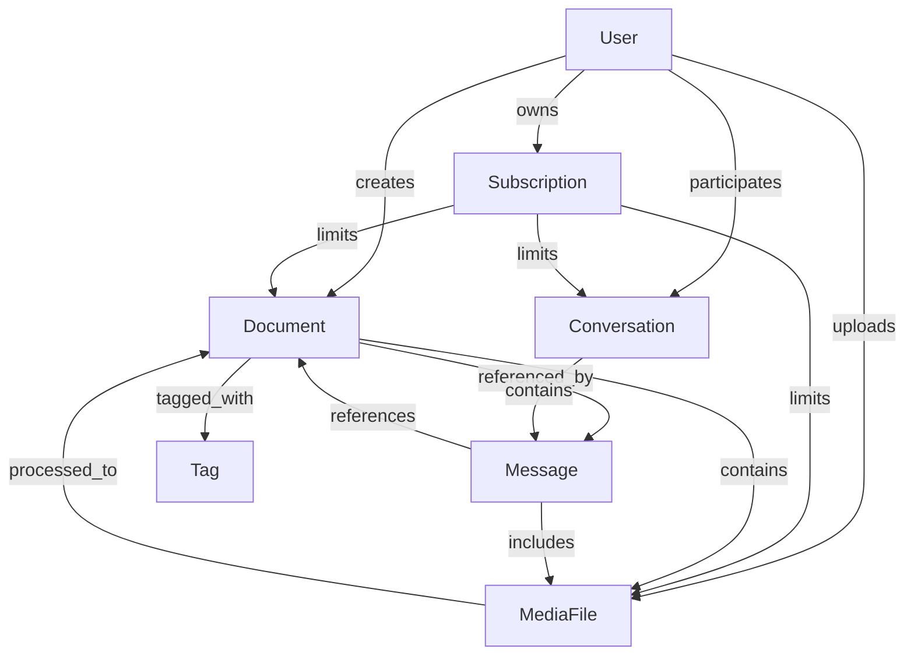

# Personal AI Assistant - Domain Context

## Domain Overview

The Personal AI Assistant is organized into five core domains following Domain-Driven Design principles. Each domain represents a distinct business area with its own models, rules, and boundaries.

## 1. User Management Domain

### Purpose
Handles user authentication, profiles, preferences, and access control. This domain is foundational as all other domains depend on user identity.

### Core Entities
- **User**: Primary entity representing system users
  - Attributes: id, email, username, hashed_password, profile
  - Invariants: Email must be unique, username must be unique
- **UserProfile**: Optional detailed user information
  - Attributes: first_name, last_name, avatar_url, timezone, language
- **UserPreferences**: User-specific settings
  - Attributes: theme, notification_settings, privacy_settings

### Key Business Rules
1. Users must authenticate with email/password or OAuth
2. Passwords must meet complexity requirements (min 8 chars, special char, number)
3. Email verification required before full access
4. Users can update profiles but not email (requires verification)
5. Soft delete: Users marked as deleted but保留 data for 30 days

### Domain Services
- AuthenticationService: Login, logout, token management
- ProfileService: Profile CRUD operations
- PreferenceService: User preferences management

### Current Implementation Status
- ✅ User entity with basic fields
- ✅ JWT authentication flow
- ⏳ OAuth integration (Google, GitHub) pending
- ⏳ Email verification service pending
- ⏳ Password reset flow pending

## 2. Subscription Domain

### Purpose
Manages subscription plans, billing, and feature access control. Integrates with payment providers for real billing.

### Core Entities
- **SubscriptionPlan**: Available subscription tiers
  - Attributes: id, name, price, interval, feature_limits
  - Examples: Free, Pro, Enterprise
- **Subscription**: User's active subscription
  - Attributes: id, user_id, plan_id, status, current_period_end
- **Payment**: Individual payment records
  - Attributes: id, subscription_id, amount, payment_method, status

### Key Business Rules
1. Free tier has limited storage (100MB) and 500 messages/month
2. Pro tier unlimited storage, 5000 messages/month
3. Enterprise tier: custom limits, priority support
4. Downgrades take effect at period end
5. Overages: Users notified but not blocked (grace period)

### Integration Points
- **User Domain**: Subscription tied to user
- **Knowledge Domain**: Storage limits affect document uploads
- **Assistant Domain**: Message limits affect AI interactions

### Current Implementation Status
- ✅ Subscription plan entities
- ✅ Basic subscription tracking
- ⏳ Stripe integration pending
- ⏳ Webhook handlers for payment events pending
- ⏳ Usage tracking service pending

## 3. Knowledge Domain

### Purpose
Manages user's personal knowledge base including documents, folders, categorization, and search functionality.

### Core Entities
- **Document**: Primary knowledge storage unit
  - Attributes: id, user_id, title, content, type, metadata
  - Types: Note, Bookmark, File, WebPage
- **Folder**: Hierarchical organization
  - Attributes: id, user_id, name, parent_id, path
- **Tag**: Flexible categorization
  - Attributes: id, user_id, name, color
- **DocumentTag**: Many-to-many relationship
- **KnowledgeGraph**: Connections between documents

### Key Business Rules
1. Folder depth limited to 10 levels
2. Document size limited by subscription tier
3. Tags are user-specific (no shared tags)
4. Full-text search across title, content, and tags
5. Automatic entity extraction from documents
6. Vector embeddings for semantic search

### Subdomains
- **Document Storage**: Raw document management
- **Organization**: Folders, tags, categorization
- **Search**: Full-text and semantic search
- **Knowledge Graph**: Document relationships

### Current Implementation Status
- ✅ Document entity with metadata
- ✅ Folder hierarchy support
- ✅ Tag system
- ⏳ Full-text search implementation
- ⏳ Vector embeddings integration
- ⏳ Knowledge graph visualization

## 4. Assistant Domain

### Purpose
Manages AI-powered conversations, context management, and intelligent interactions with user's knowledge base.

### Core Entities
- **Conversation**: Chat session with the AI
  - Attributes: id, user_id, title, created_at, updated_at
- **Message**: Individual chat messages
  - Attributes: id, conversation_id, role, content, metadata
  - Roles: user, assistant, system
- **ContextWindow**: Current conversation context
  - Attributes: conversation_id, relevant_documents, tokens_used
- **AIResponse**: Generated response with citations
  - Attributes: message_id, model, response_time, citations

### Key Business Rules
1. Context window limited to 4000 tokens
2. Messages rate limited by subscription tier
3. Conversations automatically summarize after 50 messages
4. Citations required when referencing documents
5. Context includes: recent messages, relevant documents, user preferences

### Features
- **Contextual Search**: Searches knowledge base based on conversation
- **Summarization**: Automatic conversation summarization
- **Citations**: Links responses to source documents
- **Follow-up Suggestions**: AI suggests relevant questions
- **Memory**: Remembers user preferences and conversation history

### Integration Points
- **Knowledge Domain**: Retrieves relevant documents for context
- **User Domain**: Uses user preferences for personalization
- **Multimedia Domain**: Processes images/documents in messages

### Current Implementation Status
- ✅ Conversation and message entities
- ✅ Basic chat functionality
- ⏳ Context-aware search pending
- ⏳ Citation system pending
- ⏳ Conversation summarization pending
- ⏳ OpenAI integration optimization

## 5. Multimedia Domain

### Purpose
Handles all non-text content including images, videos, audio files, and their processing for AI consumption.

### Core Entities
- **MediaFile**: Stored multimedia content
  - Attributes: id, user_id, filename, mime_type, size, url
- **MediaProcessing**: Processing job status
  - Attributes: id, media_id, job_type, status, result
  - Job types: OCR, transcription, thumbnail, extraction
- **MediaMetadata**: Extracted information
  - Attributes: id, media_id, extracted_text, duration, dimensions

### Key Business Rules
1. File size limited to 100MB per file
2. Total storage limited by subscription tier
3. Images auto-compressed to max 2MB
4. Videos processed for thumbnail generation
5. Audio files transcribed to text for search

### Processing Pipeline
1. **Upload**: File validation and storage
2. **Extraction**: Metadata, thumbnails, OCR
3. **Indexing**: Make searchable via Knowledge domain
4. **Embedding**: Generate vector representations
5. **Cleanup**: Remove temporary files

### Supported Formats
- **Images**: PNG, JPG, WebP, GIF
- **Videos**: MP4, WebM, MOV
- **Audio**: MP3, WAV, M4A
- **Documents**: PDF, DOCX (for extraction)

### Current Implementation Status
- ✅ Media file storage
- ✅ Basic metadata extraction
- ⏳ OCR implementation (Tesseract/PaddleOCR)
- ⏳ Audio transcription (Whisper)
- ⏳ Video thumbnail generation
- ⏳ AI vision model integration

## Cross-Domain Relationships

## Domain Events

### User Events
- UserCreated
- UserEmailVerified
- UserUpdated
- UserDeleted

### Subscription Events
- SubscriptionCreated
- SubscriptionPlanChanged
- SubscriptionCancelled
- PaymentProcessed

### Knowledge Events
- DocumentCreated
- DocumentUpdated
- DocumentDeleted
- FolderCreated
- TagCreated

### Assistant Events
- ConversationStarted
- MessageAdded
- ContextUpdated
- ResponseGenerated

### Multimedia Events
- MediaUploaded
- MediaProcessed
- MediaExtracted

## Shared Kernel

### Value Objects (shared across domains)
- Email
- UserId
- Timestamp
- Money
- StorageSize

### Common Services
- EventBus: Cross-domain event communication
- FileStorageService: Centralized file handling
- SearchService: Unified search interface
- NotificationService: User notifications

## Implementation Guidelines

1. **Respect Domain Boundaries**: Never directly access another domain's repositories
2. **Use Events for Communication**: Domains communicate through domain events
3. **Maintain Invariants**: Each domain enforces its own business rules
4. **Avoid Anemic Models**: Include behavior in domain entities
5. **Test Domain Logic**: Unit test all business rules and invariants

Remember: Each domain has its own expert. When working on features spanning multiple domains, collaborate with the appropriate domain specialists.