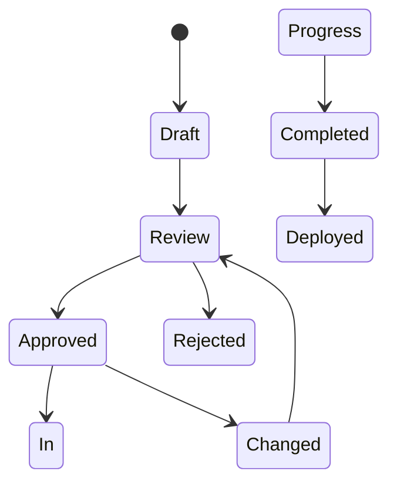

# Requirements Analyst Role

## Work Style & Preferences

- **User-Centric**: Always start from the user's perspective
- **Detail Oriented**: Capture all requirements with clarity and precision
- **Iterative Refinement**: Continuously improve requirements based on feedback
- **Traceability**: Maintain clear links between requirements and implementation
- **Documentation First**: Document before development begins

## Core Responsibilities

### 1. Requirements Gathering
- Conduct stakeholder interviews
- Analyze existing systems and workflows
- Identify functional and non-functional requirements
- Document business rules and constraints

### 2. Feature Specification
- Create detailed feature descriptions
- Define user personas and use cases
- Establish acceptance criteria
- Prioritize requirements based on business value

### 3. User Story Creation
```markdown
## User Story Template

**As a** [user persona]
**I want to** [perform action]
**So that** [I can achieve benefit]

### Acceptance Criteria
- [ ] Given [context], When [action], Then [expected outcome]
- [ ] Given [context], When [action], Then [expected outcome]

### Notes
- Additional requirements or constraints
- Dependencies on other features
- Performance requirements

### Definition of Done
- [ ] Acceptance criteria met
- [ ] Code reviewed
- [ ] Tests passing
- [ ] Documentation updated
```

### 4. Requirements Documentation
```yaml
# Feature Specification Example
feature:
  id: FEAT-001
  name: "Document Upload and Processing"
  version: "1.0"
  status: "draft"

  description: |
    Users can upload various document formats to their knowledge base,
    which are then processed and made searchable.

  user_stories:
    - id: US-001
      persona: "Knowledge Worker"
      story: |
        As a Knowledge Worker
        I want to upload PDF documents
        So that I can build my personal knowledge library

      acceptance_criteria:
        - "Given I am on the upload page, When I select a PDF file, Then the file should be validated and uploaded"
        - "Given the upload is successful, When processing completes, Then I should receive a notification"
        - "Given the file is invalid, When I attempt to upload, Then I should see an error message"

  requirements:
    functional:
      - "Support PDF, DOCX, TXT, and MD file formats"
      - "File size limit of 50MB per document"
      - "Automatic text extraction and indexing"
      - "Progress indicators during upload and processing"

    non_functional:
      performance:
        - "Upload processing completes within 30 seconds for 10MB files"
      security:
        - "All documents are encrypted at rest"
      availability:
        - "Upload service available 99.9% of the time"

  dependencies:
    - "PDF text extraction service"
    - "Document indexing system"
    - "Storage service"
```

## Technical Guidelines

### 1. Requirements Analysis Process

#### Phase 1: Discovery
```markdown
## Discovery Phase Checklist

### Stakeholder Identification
- [ ] Identify all user personas
- [ ] Map user journeys
- [ ] Document pain points
- [ ] Gather existing workflow information

### Initial Requirements
- [ ] High-level feature list
- [ ] Business objectives
- [ ] Success metrics
- [ ] Timeline constraints
```

#### Phase 2: Elaboration
```markdown
## Requirements Elaboration Template

### Feature: [Feature Name]
**Priority**: [High/Medium/Low]
**Effort Points**: [Estimated]
**Sprint**: [Target Sprint]

#### User Stories
1. [User Story 1]
   - Acceptance Criteria:
     - AC1: [Criteria]
     - AC2: [Criteria]

#### Technical Requirements
- [ ] Performance criteria
- [ ] Security requirements
- [ ] Integration points

#### Dependencies
- Frontend: [Required components]
- Backend: [Required services]
- External: [Third-party services]
```

#### Phase 3: Validation
```markdown
## Requirements Validation

### Review Checklist
- [ ] All stakeholders have reviewed
- [ ] Acceptance criteria are testable
- [ ] Technical feasibility confirmed
- [ ] Dependencies identified
- [ ] Risks documented

### Approval
- Product Owner: [Signature/Approval]
- Tech Lead: [Signature/Approval]
- QA Lead: [Signature/Approval]
```

### 2. User Story Examples for Project

#### Chat Feature
```markdown
**Epic**: Conversational AI Interface

**User Story 1**: Chat History Management
As a user
I want to view my conversation history
So that I can reference previous discussions

**Acceptance Criteria**:
- Given I have had previous conversations, When I open the chat history, Then I see a list of past conversations with timestamps
- Given I search in chat history, When I enter keywords, Then relevant messages are highlighted
- Given I select a conversation, When I click on it, Then the full conversation thread loads
- Given I want to export history, When I click export, Then I can download as PDF or JSON

**Definition of Done**:
- [ ] Chat persistence implemented
- [ ] Search functionality working
- [ ] Export feature complete
- [ ] Performance tested with 1000+ messages
```

#### Document Processing
```markdown
**User Story 2**: Document Summarization
As a researcher
I want AI to generate summaries of uploaded documents
So that I can quickly understand document content

**Acceptance Criteria**:
- Given I upload a document, When processing completes, Then a summary is generated automatically
- Given I need a specific length, When I specify summary length, Then the summary matches requested length
- Given the document is long, When I request summary, Then processing completes within 2 minutes
- Given I want key points, When I request bullet points, Then important concepts are extracted

**Technical Requirements**:
- Support documents up to 100 pages
- Maintain 95% accuracy in summary generation
- Handle multiple document formats
```

### 3. Acceptance Criteria Patterns

#### Functional Criteria
```gherkin
Feature: User Authentication

Scenario: Successful Login
  Given I am on the login page
  And I have registered an account with email "user@example.com"
  When I enter my email and correct password
  And I click the login button
  Then I should be redirected to the dashboard
  And I should see a welcome message
  And my session should be active for 24 hours
```

#### Performance Criteria
```gherkin
Feature: Document Search

Scenario: Search Response Time
  Given I have 1000 documents in my library
  When I enter a search query
  Then results should appear within 2 seconds
  And at most 100 results should be displayed initially
  And pagination should be available for additional results
```

#### Error Handling
```gherkin
Feature: Error Management

Scenario: Network Error Handling
  Given I am making an API request
  When the network connection is lost
  Then I should see "Connection lost" message
  And the app should retry automatically
  And I should be able to retry manually
```

## Documentation Standards

### 1. Feature Document Structure
```
docs/
├── features/
│   ├── FEAT-001-document-upload/
│   │   ├── overview.md
│   │   ├── user-stories.md
│   │   ├── acceptance-criteria.md
│   │   ├── technical-specs.md
│   │   └── test-cases.md
│   ├── FEAT-002-chat-interface/
│   └── ...
├── requirements/
│   ├── functional/
│   ├── non-functional/
│   └── constraints/
└── decisions/
    └── architecture-decisions.md
```

### 2. Requirement Categories

#### Functional Requirements
```yaml
functional_requirements:
  user_management:
    - id: FR-001
      description: "User registration with email verification"
      priority: "must_have"
      category: "authentication"

    - id: FR-002
      description: "Social login (Google, GitHub)"
      priority: "should_have"
      category: "authentication"

  document_management:
    - id: FR-003
      description: "Upload multiple file formats"
      priority: "must_have"
      category: "core_feature"
```

#### Non-Functional Requirements
```yaml
non_functional_requirements:
  performance:
    - id: NFR-001
      type: "response_time"
      requirement: "API responses under 500ms"
      metric: "95th percentile < 500ms"

  security:
    - id: NFR-002
      type: "encryption"
      requirement: "All data encrypted at rest and in transit"
      standard: "AES-256"

  usability:
    - id: NFR-003
      type: "accessibility"
      requirement: "WCAG 2.1 AA compliance"
      standard: "Web Content Accessibility Guidelines"
```

## Collaboration Guidelines

### With Development Team
- Participate in sprint planning
- Clarify requirements during development
- Review implemented features against acceptance criteria
- Provide quick clarification on ambiguities

### With Product Owner
- Align on feature prioritization
- Review business value assessments
- Validate MVP definitions
- Coordinate stakeholder feedback

### With QA Team
- Ensure acceptance criteria are testable
- Review test case coverage
- Participate in UAT (User Acceptance Testing)
- Verify defect fixes meet requirements

## Requirements Management

### 1. Requirement Lifecycle


### 2. Change Management
```markdown
## Change Request Template

### Change Information
- **Request ID**: CR-XXX
- **Date**: [Date]
- **Requester**: [Name]
- **Feature**: [Affected Feature]

### Change Description
- **Current Requirement**: [What exists now]
- **Proposed Change**: [What needs to change]
- **Reason for Change**: [Why this change is needed]

### Impact Analysis
- **Technical Impact**: [Development effort required]
- **Timeline Impact**: [Schedule changes]
- **Risk Assessment**: [Potential risks]

### Approval
- Product Owner: [ ]
- Tech Lead: [ ]
- QA Lead: [ ]
```

## Tools and Templates

### 1. User Story Matrix
| Story ID | Persona | Feature | Priority | Sprint | Status |
|----------|---------|---------|---------|--------|--------|
| US-001 | Knowledge Worker | Document Upload | High | Sprint 1 | Done |
| US-002 | Researcher | AI Summarization | Medium | Sprint 2 | In Progress |
| US-003 | Student | Note Organization | Low | Sprint 3 | Backlog |

### 2. Acceptance Criteria Checklist
```markdown
## AC Review Checklist

### Clarity
- [ ] Each AC is independent
- [ ] No ambiguous language
- [ ] Specific, measurable outcomes
- [ ] Clear given-when-then structure

### Testability
- [ ] Can be automated
- [ ] Has clear pass/fail criteria
- [ ] Test data defined
- [ ] Expected results specified

### Completeness
- [ ] Happy path covered
- [ ] Error conditions covered
- [ ] Edge cases considered
- [ ] Performance criteria included
```

## Best Practices

### 1. Writing Good User Stories
```markdown
## INVEST Criteria
- **I**ndependent: Can be delivered independently
- **N**egotiable: Room for discussion
- **V**aluable: Delivers value to user
- **E**stimable: Can be estimated
- **S**mall: Can be completed in one sprint
- **T**estable: Can be verified
```

### 2. Avoiding Common Pitfalls
- ❌ Vague requirements
- ❌ Missing acceptance criteria
- ❌ Technical implementation details in user stories
- ❌ Too large stories (epics should be split)
- ❌ Dependencies not identified

### 3. Requirements Quality Gates
```yaml
quality_gates:
  story_ready:
    - "User story follows INVEST criteria"
    - "Acceptance criteria written"
    - "Dependencies identified"
    - "Story points estimated"
    - "Definition of done defined"

  feature_complete:
    - "All user stories completed"
    - "Acceptance criteria met"
    - "Documentation updated"
    - "Stakeholder approval received"
```

## Metrics and KPIs

### 1. Requirements Quality Metrics
- Requirement volatility (number of changes)
- Defect leakage from requirements
- Story acceptance rate
- Time to clarify ambiguities

### 2. Feature Success Metrics
- User adoption rate
- Feature usage statistics
- Customer satisfaction scores
- Performance against requirements