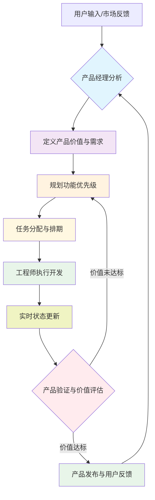

# Product-Driven Development Workflow

## 概述

这是一个以产品经理为核心的4阶段迭代开发流程，专注于商业价值和用户需求。所有用户输入都首先通过产品经理进行分析，确保产品功能能够创造真正的商业价值和卓越的用户体验。

## 核心原则

1. **商业价值优先** - 每个功能都必须有明确的商业价值主张
2. **用户中心** - 深入理解用户痛点，以用户需求为出发点
3. **数据驱动** - 基于数据和反馈做决策，而不是凭感觉
4. **持续验证** - 在每个阶段都验证价值和可行性
5. **迭代优化** - 通过快速迭代不断改进产品

## 工作流程图



## 阶段详解

### Stage 1: Product Analysis & Requirement Definition
**负责人**: Product Manager (产品经理)

**触发条件**: 任何用户输入、市场反馈或业务需求

**执行步骤**:

1. **产品分析**
   ```markdown
   - 深入理解用户痛点和真实需求
   - 分析商业价值和市场机会
   - 评估与现有产品策略的契合度
   - 研究竞品和最佳实践
   - 定义成功指标和KPI
   ```

2. **需求定义**
   ```markdown
   - 撰写产品需求文档(PRD)
   - 定义用户画像和使用场景
   - 明确功能范围和MVP定义
   - 设定验收标准和成功指标
   ```

3. **文档操作**
   ```markdown
   - 新功能: 在 specs/active/[module]/ 创建新的 requirement.md
   - 功能改进: 更新现有的 requirement.md
   - 使用 templates/requirement-template.md 作为模板
   ```

4. **输出物**
   - 完整的产品需求文档（PRD）
   - 商业价值分析报告
   - 用户研究和数据分析
   - 成功指标定义

**示例输出**:
```bash
# 创建新需求
mkdir -p specs/active/ai-search
cp specs/templates/requirement-template.md specs/active/ai-search/requirement.md
# 更新需求ID为 REQ-20240120-001
```

### Stage 2: Feature Planning & Task Assignment
**负责人**: Product Manager (产品经理)

**执行步骤**:

1. **功能规划**
   ```markdown
   - 基于产品路线图规划功能
   - 使用价值 vs 成本矩阵确定优先级
   - 定义MVP范围和迭代计划
   - 评估资源需求和风险
   - 设定发布时间线
   ```

2. **任务分解与分配**
   ```markdown
   - 将功能分解为可执行的任务
   - 识别任务依赖关系
   - 分配给合适的工程师：
     * Backend任务 → @backend-dev
     * Frontend任务 → @frontend-dev
     * Mobile任务 → @mobile-dev
     * 架构任务 → @architect
     * 测试任务 → @test-engineer
     * DevOps任务 → @devops-engineer
   ```

3. **创建任务跟踪文档**
   ```bash
   cp specs/templates/task-tracking-template.md specs/active/[module]/tasks.md
   ```

**优先级矩阵示例**:
```
高价值 | MVP任务 - 高优先级
       | 增强功能 - 中优先级
-------|-----------------------
低价值 | 优化任务 - 低优先级
       | 暂缓任务 - 待定
```

### Stage 3: Development Execution & Status Tracking
**负责人**: Engineering Team (工程师团队)

**执行流程**:

1. **任务接收与理解**
   - 从产品需求文档中理解用户价值
   - 澄清技术方案和实现细节
   - 评估工作量和时间

2. **开发执行**
   ```markdown
   - 按照产品需求实现功能
   - 编写单元测试和集成测试
   - 遵循代码规范和最佳实践
   - 进行代码评审
   ```

3. **实时状态更新**
   ```markdown
   在任务跟踪文档中实时更新:
   - 任务状态: Todo → In Progress → Review → Done
   - 进度百分比
   - 遇到的技术挑战和解决方案
   - 代码位置和PR链接
   - 测试覆盖率和质量指标
   ```

**状态更新示例**:
```markdown
### [TASK-B-001] AI搜索API开发
- **状态**: In Progress (75%)
- **当前进度**: 核心搜索算法已完成，正在优化性能
- **代码位置**: backend/app/api/v1/ai_search.py
- **PR**: #1234
- **性能**: 响应时间从500ms优化到150ms
- **下一步**: 添加缓存机制
```

### Stage 4: Product Validation & Business Value Assessment
**负责人**: Product Manager (产品经理)

**执行步骤**:

1. **功能验收**
   ```markdown
   - 验证所有功能是否按PRD实现
   - 进行用户体验测试
   - 检查性能和稳定性
   - 确认安全和合规要求
   ```

2. **商业价值评估**
   ```markdown
   - 收集用户反馈和满意度数据
   - 分析使用数据和指标
   - 评估ROI和商业影响
   - 对比预设的成功指标
   ```

3. **迭代决策**
   ```markdown
   价值达标:
   - 发布到生产环境
   - 收集更多用户反馈
   - 规划后续优化

   价值未达标:
   - 分析问题根因
   - 制定改进方案
   - 返回Stage 2重新规划
   ```

4. **创建验证报告**
   ```bash
   cp specs/templates/verification-template.md specs/active/[module]/verification.md
   ```

5. **产品发布**
   ```markdown
   - 准备发布说明
   - 通知市场和销售团队
   - 监控发布后的表现
   - 收集用户反馈
   - 移动需求到 specs/completed/
   ```

## 角色职责矩阵

| 活动 | Product Manager | Architect | Backend Dev | Frontend Dev | Mobile Dev | Test Engineer | DevOps Engineer |
|------|-----------------|-----------|-------------|--------------|------------|----------------|-----------------|
| 产品战略制定 | ✅ 主导 | ⭕ 协助 | ⭕ 协助 | ⭕ 协助 | ⭕ 协助 | ⭕ 协助 | ⭕ 协助 |
| 用户研究分析 | ✅ 主导 | ⭕ 参与 | ⭕ 参与 | ⭕ 参与 | ⭕ 参与 | ⭕ 参与 | ⭕ 参与 |
| PRD撰写 | ✅ 主导 | ⭕ 评审 | ⭕ 评审 | ⭕ 评审 | ⭕ 评审 | ⭕ 评审 | ⭕ 评审 |
| 功能优先级 | ✅ 主导 | ⭕ 评估 | ⭕ 评估 | ⭕ 评估 | ⭕ 评估 | ⭕ 评估 | ⭕ 评估 |
| 技术方案设计 | ⭕ 定义需求 | ✅ 主导 | ⭕ 协助 | ⭕ 协助 | ⭕ 协助 | ⭕ 评审 | ⭕ 评审 |
| Backend开发 | ⭕ 验收价值 | ⭕ 评审 | ✅ 主导 | | | ⭕ 协助 | |
| Frontend开发 | ⭕ 验收价值 | ⭕ 评审 | | ✅ 主导 | | ⭕ 协助 | |
| Mobile开发 | ⭕ 验收价值 | ⭕ 评审 | | | ✅ 主导 | ⭕ 协助 | |
| 质量保证 | ⭕ 定义标准 | ⭕ 评审 | ⭕ 协助 | ⭕ 协助 | ⭕ 协助 | ✅ 主导 | |
| 产品发布 | ✅ 决策 | ⭕ 支持 | ⭕ 支持 | ⭕ 支持 | ⭕ 支持 | ⭕ 支持 | ✅ 主导 |
| 数据分析 | ✅ 主导 | ⭕ 协助 | ⭕ 协助 | ⭕ 协助 | ⭕ 协助 | ⭕ 协助 | ⭕ 协助 |

✅ 主导责任 | ⭕ 协助责任

## 产品价值评估框架

### 价值维度

1. **用户价值**
   - 解决用户痛点程度
   - 提升用户效率
   - 改善用户体验
   - 用户满意度(NPS)

2. **商业价值**
   - 收入增长潜力
   - 成本节约
   - 市场竞争优势
   - 客户留存率

3. **技术价值**
   - 技术创新性
   - 系统可扩展性
   - 技术债务减少
   - 开发效率提升

### 评估方法

```yaml
价值评估流程:
  1. 设定评估指标:
     - 定量指标: DAUAU、转化率、留存率
     - 定性指标: 用户反馈、满意度调研

  2. 数据收集:
     - 用户行为数据
     - A/B测试结果
     - 用户访谈
     - 市场调研

  3. 价值计算:
     - 价值得分 = (用户价值 × 0.4) + (商业价值 × 0.4) + (技术价值 × 0.2)

  4. 决策制定:
     - 得分 > 8: 继续投入
     - 得分 5-8: 优化改进
     - 得分 < 5: 重新考虑
```

## 质量门禁

### Stage 1 质量检查（产品价值）
- [ ] 用户痛点定义清晰
- [ ] 商业价值主张明确
- [ ] 成功指标可量化
- [ ] MVP范围合理
- [ ] PRD文档完整

### Stage 2 质量检查（规划合理性）
- [ ] 功能优先级清晰
- [ ] 资源分配合理
- [ ] 风险识别充分
- [ ] 时间线可行
- [ ] 依赖关系明确

### Stage 3 质量检查（开发质量）
- [ ] 代码质量达标
- [ ] 测试覆盖率 > 80%
- [ ] 性能指标达标
- [ ] 安全检查通过
- [ ] 文档更新及时

### Stage 4 质量检查（价值验证）
- [ ] 用户反馈积极
- [ ] 关键指标达成
- [ ] ROI符合预期
- [ ] 竞争优势明显
- [ ] 可持续发展

## 协作指南

### 沟通协议

1. **产品决策沟通**
   ```markdown
   @team 产品决策说明：
   - 决策内容：[具体决策]
   - 决策依据：[数据和分析]
   - 影响范围：[影响的团队和功能]
   - 执行计划：[下一步行动]
   ```

2. **进度汇报**
   ```markdown
   [功能名称] 进度汇报：
   - 整体进度：[百分比]
   - 本周完成：[具体任务]
   - 下周计划：[计划任务]
   - 风险和阻塞：[问题描述]
   - 需要支持：@提及
   ```

3. **价值验证**
   ```markdown
   [功能] 价值验证报告：
   - 用户数据：[关键指标]
   - 用户反馈：[反馈总结]
   - 商业价值：[价值体现]
   - 改进建议：[优化方向]
   ```

### 文档管理最佳实践

1. **PRD撰写规范**
   - 始终从用户价值出发
   - 包含明确的成功指标
   - 定期更新保持同步
   - 版本控制确保可追溯

2. **数据驱动决策**
   - 所有决策必须有数据支撑
   - 建立完整的数据收集机制
   - 定期分析并分享洞察
   - 基于数据调整产品方向

## 工具和模板

### 产品管理工具
- `specs/templates/requirement-template.md` - PRD模板
- `specs/templates/task-tracking-template.md` - 任务跟踪模板
- `specs/templates/verification-template.md` - 价值验证模板
- `docs/workflow/product-value-metrics.md` - 价值指标库

### 数据分析工具
- 用户行为分析平台
- A/B测试工具
- 用户反馈收集系统
- 数据可视化工具

## 示例场景

### 场景1：AI搜索功能开发

**用户输入**: "我想要一个能理解我意图的智能搜索功能"

**产品经理执行**:
1. **产品分析**: 发现用户当前搜索准确率仅60%，平均需要3次尝试
2. **价值定义**: 提升搜索准确率到90%，减少用户操作步骤
3. **MVP规划**: 先实现文本语义搜索，后续扩展到多模态
4. **任务分配**: Backend(语义分析)、Frontend(搜索UI)、ML(模型训练)
5. **价值验证**: 通过A/B测试验证准确率提升和用户满意度

### 场景2：性能优化

**用户反馈**: "文档加载太慢了"

**产品经理执行**:
1. **问题分析**: 平均加载时间5秒，用户流失率增加30%
2. **价值评估**: 优化到1秒内，预计提升用户留存15%
3. **方案规划**: CDN优化、懒加载、缓存策略
4. **资源协调**: Backend(API优化)、Frontend(加载优化)、DevOps(CDN配置)
5. **效果验证**: 监控加载时间和用户留存率变化

## 成功指标

### 产品指标
- 用户增长率月环比
- 用户活跃度(DAUAU)
- 功能采用率
- 用户留存率
- 客户满意度(NPS)

### 业务指标
- 收入增长
- 获客成本降低
- 客户生命周期价值
- 市场份额

### 开发效率指标
- 需求到交付周期
- 代码质量
- 发布频率
- 系统稳定性

## 持续改进

### 反馈循环
1. 收集用户反馈
2. 分析数据洞察
3. 识别改进机会
4. 快速迭代验证
5. 持续优化产品

### 学习机制
- 定期产品复盘
- 用户深度访谈
- 竞品分析
- 行业最佳实践学习

---

**版本**: 2.0.0
**最后更新**: 2024-01-20
**维护人**: Product Manager
**核心理念**: 以产品价值驱动开发，为用户创造真正的价值