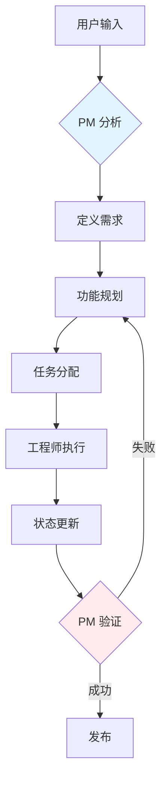

# Personal AI Assistant - 代理系统文档

## 系统概述

本项目采用**产品驱动开发模式**的多代理协作系统，包含7个专业工程师角色，由产品经理主导，支持并行开发和协作完成项目任务。

**版本**: 2.1.0
**最后更新**: 2025-01-17

---

## Agent 角色

### 角色配置矩阵

| 角色 | 角色类型 | 优先级 | MCP 工具（推荐） |
|------|-----------|----------|-------------------------|
| 产品经理 | 负责人 | 1 | context7, exa |
| 架构师 | 专家 | 2 | context7, exa |
| 后端工程师 | 实现者 | 3 | context7, exa |
| 前端工程师 | 实现者 | 3 | context7, exa |
| 移动端工程师 | 实现者 | 3 | context7, exa |
| 测试工程师 | 验证者 | 4 | context7, exa |
| 运维工程师 | 支持者 | 4 | context7, exa |

---

### 1. 产品经理

**图标**: 📋
**路径**: `.claude/agents/roles/product-manager.md`
**角色类型**: 负责人（核心领导者）

**职责**:
- 定义产品需求和功能规划
- 分析用户需求和技术可行性
- 在 `specs/` 中创建和维护需求文档
- 协调所有工程团队之间的工作
- 验证功能完成度和用户体验
- **必须**: 始终是第一个分析用户请求的角色
- **必须**: 在任何开发之前在 `specs/active/` 创建需求文档
- **必须**: 进行最终验证并更新文档状态

**MCP 工具**:
- context7: 推荐用于研究类似功能和最佳实践
- exa: 推荐用于查找实现示例和用户体验模式

---

### 2. 架构师

**图标**: 🏛️
**路径**: `.claude/agents/roles/architect.md`
**角色类型**: 专家

**职责**:
- 技术架构设计
- 技术选型决策
- 架构文档编写
- DDD 架构设计

**MCP 工具**:
- context7: 推荐用于库文档研究
- exa: 推荐用于架构模式和最佳实践

**默认工作流**: architecture-review

**技术栈**: Python, TypeScript, 系统设计, API 设计

---

### 3. 后端工程师

**图标**: ⚙️
**路径**: `.claude/agents/roles/backend-dev.md`
**角色类型**: 实现者

**职责**:
- API 接口开发
- 数据库设计与实现
- 业务逻辑实现
- 单元测试和集成测试
- 代码注释使用团队主要语言
- 实现 FastAPI/Python 后端服务

**MCP 工具**:
- context7: 推荐用于 FastAPI、SQLAlchemy、Python 文档
- exa: 推荐用于实现示例和解决方案

**默认工作流**: feature-development

**技术栈**:
- FastAPI (async/await)
- SQLAlchemy (async)
- PostgreSQL
- Redis
- Celery (后台任务)

---

### 4. 前端工程师

**图标**: 🖥️
**路径**: `.claude/agents/roles/frontend-dev.md`
**角色类型**: 实现者

**职责**:
- UI 组件开发（Material 3），支持国际化
- 用户交互实现
- 响应式设计（flutter_adaptive_scaffold）
- Widget 测试（页面功能必须）
- 实现语言切换功能
- Flutter 桌面和 Web 开发

**MCP 工具**:
- context7: 推荐用于 Flutter、Material 3、Riverpod 文档
- exa: 推荐用于 Flutter UI 模式和示例

**默认工作流**: feature-development

**技术栈**:
- Flutter (Dart)
- Material 3 设计系统
- flutter_adaptive_scaffold (响应式布局)
- Riverpod (状态管理)
- Dio (HTTP 客户端)
- Hive (本地存储)

**UI 要求**:
- 专用 Material 3 组件
- 实现桌面、Web、移动端的自适应布局
- 支持断点：mobile (<600dp)、tablet (600-840dp)、desktop (>840dp)
- 所有新页面必须使用 AdaptiveScaffold 或 AdaptiveLayout

---

### 5. 移动端工程师

**图标**: 📱
**路径**: `.claude/agents/roles/mobile-dev.md`
**角色类型**: 实现者

**职责**:
- 移动平台适配（iOS/Android）
- 原生功能集成
- 性能优化
- 移动端特定测试
- 为移动平台实现国际化支持

**MCP 工具**:
- context7: 推荐用于 Flutter 平台特定文档
- exa: 推荐用于移动开发模式

**默认工作流**: feature-development

**技术栈**:
- Flutter (iOS/Android)
- Platform channels (原生集成)
- 移动端特定插件

---

### 6. 测试工程师

**图标**: 🧪
**路径**: `.claude/agents/roles/test-engineer.md`
**角色类型**: 验证者

**职责**:
- 测试策略制定
- 自动化测试实现
- 质量门禁把控
- 创建验证报告
- 测试 UI 语言切换功能

**MCP 工具**:
- context7: 推荐用于 pytest、flutter_test 文档
- exa: 推荐用于测试模式和最佳实践

**默认工作流**: bug-fix

**测试规则**:
- Flutter 页面功能**必须**使用 Widget 测试
- 单元测试仅用于纯逻辑函数
- 集成测试用于完整工作流

**技术栈**: pytest, Flutter test, 性能测试, CI/CD 测试

---

### 7. 运维工程师

**图标**: ⚙️
**路径**: `.claude/agents/roles/devops-engineer.md`
**角色类型**: 支持者

**职责**:
- CI/CD 流水线设置
- 部署自动化
- 监控和告警
- 基础设施管理
- 在部署中配置语言检测

**MCP 工具**:
- context7: 推荐用于 Docker、K8s、CI/CD 文档
- exa: 推荐用于 DevOps 模式和基础设施解决方案

**默认工作流**: feature-development

**技术栈**:
- Docker & Docker Compose
- PostgreSQL (容器化)
- Redis (容器化)
- Celery workers
- 后端服务部署

---

## 工作流程

### 1. 产品驱动开发（主要工作流）

**路径**: `.claude/agents/workflows/product-driven-development.md`
**描述**: 4 阶段工作流，产品经理为核心驱动者
**强制执行**: 是（所有功能开发必须）
**参与者**: 所有 7 个角色

#### 4 个阶段



**阶段 1: 需求分析与定义**
- **负责人**: 产品经理
- **交付物**:
  - `specs/active/` 中的需求文档
  - 用户故事和验收标准
  - 技术需求
  - 成功标准

**阶段 2: 功能规划与任务分配**
- **负责人**: 产品经理
- **交付物**:
  - 任务分配计划
  - MVP 范围定义
  - 时间线和里程碑
  - 资源分配
- **任务分配**:
  - 后端任务 → @backend-dev
  - 前端任务 → @frontend-dev
  - 移动端任务 → @mobile-dev
  - 架构任务 → @architect
  - 测试任务 → @test-engineer
  - 运维任务 → @devops-engineer

**阶段 3: 开发执行与状态跟踪**
- **负责人**: 被分配的工程师
- **交付物**:
  - 实现的功能
  - 单元测试和集成测试
  - 代码文档
  - 状态更新
- **推荐**: 实现前使用 context7/exa 进行研究

**阶段 4: 产品验证**
- **负责人**: 产品经理
- **交付物**:
  - 更新的需求文档状态
  - 功能验证结果
- **操作**: 将需求文档移动到 `specs/completed/`

#### 工作流关卡

| 阶段 | 关卡 | 要求 | 验证方式 |
|-------|------|----------|------------|
| 1 | requirement_doc_created | 进入阶段 2 | 检查 specs/active/ 中是否存在文档 |
| 2 | tasks_assigned | 进入阶段 3 | 检查任务是否正确分配 |
| 3 | development_complete | 进入阶段 4 | 检查所有开发任务是否完成 |
| 4 | validation_complete | 完成工作流 | 检查文档是否移动到 completed/ |

---

### 2. 功能开发

**路径**: `.claude/agents/workflows/feature-development.md`
**描述**: 端到端功能开发工作流
**参与者**: 所有 7 个角色
**预计时长**: 2-3 周

**阶段**:
1. 需求分析
2. 研究与规划
3. 实现
4. 测试与验证

---

### 3. Bug 修复

**路径**: `.claude/agents/workflows/bug-fix.md`
**描述**: Bug 分类和解决工作流
**参与者**: PM、测试工程师、开发人员、运维
**预计时长**: 1-5 天

**阶段**:
1. Bug 复现
2. 研究解决方案
3. 实现
4. 验证

---

### 4. 架构评审

**路径**: `.claude/agents/workflows/architecture-review.md`
**描述**: 架构设计和评审工作流
**参与者**: 架构师、所有角色
**预计时长**: 2-4 小时

**阶段**:
1. 研究阶段
2. 设计阶段
3. 评审阶段
4. 文档化

---

## MCP 工具使用

### 概述

本项目支持使用 MCP (Model Context Protocol) 工具来提高开发效率，通过查询文档和查找实现示例。

### Context7 - 库文档查询

使用 `context7` 获取最新的库文档和代码示例：

**使用时机**:
- 学习新的库 API
- 查找正确的使用模式
- 获取特定功能的代码示例
- 理解库架构

**使用方法**:
```bash
# 1. 解析库 ID
mcp__context7__resolve-library-id: "fastapi"

# 2. 查询文档
mcp__context7__query-docs: library_id="/tiangolo/fastapi", query="dependency injection"
```

**示例**:
```yaml
# FastAPI 依赖注入
→ resolve-library-id: "fastapi"
→ query-docs: "/tiangolo/fastapi", "dependency injection"

# Flutter Material 3 组件
→ resolve-library-id: "flutter"
→ query-docs: "/flutter/flutter", "Material 3 components"

# Riverpod 状态管理
→ resolve-library-id: "riverpod"
→ query-docs: "/riverpod/riverpod", "providers"
```

### Exa - 代码上下文和解决方案

使用 `exa` 搜索编码解决方案和实现示例：

**使用时机**:
- 查找实现示例
- 研究最佳实践
- 解决特定技术问题
- 学习设计模式

**使用方法**:
```bash
mcp__exa__get_code_context_exa: query="FastAPI JWT authentication implementation"
```

**示例**:
```yaml
# FastAPI JWT 认证
→ query: "FastAPI JWT authentication implementation"
→ 返回: JWT 认证的代码示例和模式

# Flutter 自适应布局
→ query: "Flutter adaptive scaffold responsive layout"
→ 返回: 响应式 Flutter 布局示例

# Docker PostgreSQL 设置
→ query: "Docker Compose PostgreSQL FastAPI"
→ 返回: Docker 配置示例
```

### MCP 优先开发方法

**推荐工作流**:

1. **接收任务** → 识别所需的库/技术

2. **研究阶段（可选但推荐）**:
   ```bash
   # 使用 context7 获取官方库文档
   context7 → 获取 FastAPI 路由和依赖注入文档

   # 使用 exa 查找实现示例
   exa → 查找类似的端点实现示例

   # 审查现有代码库模式
   审查 backend/app/domains/ 结构
   ```

3. **规划实现**:
   - 基于文档和示例
   - 遵循项目架构模式
   - 考虑现有代码标准

4. **实现**:
   - 按照研究的模式编写代码
   - 根据需要参考文档
   - 应用最佳实践

5. **验证**:
   - 运行测试
   - 对照文档验证
   - 检查代码质量

---

## 目录结构

```
.claude/agents/
├── README.md                           # Agent 系统 README
├── agents.json                         # Agent 配置文件
├── roles/                              # Agent 角色定义
│   ├── product-manager.md              # 产品经理角色
│   ├── architect.md                    # 架构师角色
│   ├── backend-dev.md                  # 后端开发者角色
│   ├── frontend-dev.md                 # 前端开发者角色
│   ├── mobile-dev.md                   # 移动端开发者角色
│   ├── test-engineer.md                # 测试工程师角色
│   └── devops-engineer.md              # 运维工程师角色
├── workflows/                          # 工作流定义
│   ├── product-driven-development.md   # 主 PDD 工作流
│   ├── feature-development.md          # 功能开发工作流
│   ├── bug-fix.md                      # Bug 修复工作流
│   └── architecture-review.md          # 架构评审工作流
├── templates/                          # 模板和检查清单
│   ├── workflow-validation-checklist.md
│   └── product-manager-workflow-guide.md
├── scripts/                            # 自动化脚本
│   └── workflow-violation-handler.sh
├── prompts/                            # 系统提示词
│   ├── base-prompt.md                  # 共享知识库
│   └── domain-context.md               # 领域特定上下文
├── coordination/                       # 协调机制
│   ├── task-board.md                   # 任务跟踪系统
│   └── communication.md                # 通信协议
└── config/                             # 配置文件
    └── base-agent.md                   # 基础代理配置
```

---

## 快速开始

### 1. 直接用户输入（推荐）

无需特定命令，直接描述你的需求：

```bash
用户: "添加用户时区设置功能"
用户: "修复搜索结果不准确的bug"
用户: "实现语音备忘录功能"
```

**流程**: 产品经理自动分析并创建需求文档

---

### 2. 手动角色激活

```bash
/role product-manager
/role architect
/role backend-dev
/role frontend-dev
/role mobile-dev
/role test-engineer
/role devops-engineer
```

---

### 3. 工作流命令

```bash
/workflow product-driven-development
/workflow feature-development
/workflow bug-fix
/workflow architecture-review
```

---

## 验证规则

### 工作流强制执行

```yaml
workflow_enforcement:
  enabled: true
  strict_mode: true
  auto_validation: true
  violation_handling: stop_and_correct
```

### 强制性规则

1. **需求文档必须存在**
   - 任何开发开始前必须在 `specs/active/` 创建需求文档
   - 执行: 严格

2. **产品经理必须主导**
   - 产品经理必须是第一个分析任何用户请求的角色
   - 执行: 严格

3. **验证必须完成**
   - 在标记任务完成前必须完成产品经理的最终验证
   - 执行: 严格

4. **API 错误消息必须包含中英文**
   - API 错误响应必须包含中文和英文消息
   - 执行: 严格

5. **前端必须支持国际化**
   - 前端组件必须实现国际化支持
   - 执行: 严格

---

## API 国际化实现指南

### 后端实现

```python
# API 错误响应（包含中英文）
class ErrorResponse(BaseModel):
    error_code: str
    message_en: str  # 英文消息
    message_zh: str  # 中文消息
    detail: Optional[str] = None

# 示例
@app.exception_handler(UserNotFoundException)
async def user_not_found_handler(request: Request, exc: UserNotFoundException):
    return JSONResponse(
        status_code=404,
        content={
            "error_code": "USER_NOT_FOUND",
            "message_en": "User not found",
            "message_zh": "未找到用户",
            "detail": str(exc)
        }
    )
```

### 前端实现

```dart
// UI 标签（支持多语言）
class AppLocalizations {
  static const Map<String, Map<String, String>> _translations = {
    'en': {
      'search': 'Search',
      'settings': 'Settings',
      'podcast_episodes': 'Podcast Episodes',
      'transcript': 'Transcript',
      'summary': 'Summary',
    },
    'zh': {
      'search': '搜索',
      'settings': '设置',
      'podcast_episodes': '播客单集',
      'transcript': '转录文本',
      'summary': '摘要',
    },
  };

  static String get(String key) {
    final locale = Get.locale?.languageCode ?? 'en';
    return _translations[locale]?[key] ?? _translations['en']![key]!;
  }
}
```

---

## 开发规则

### 代码质量

1. **遵循编码标准**
   - 遵循项目编码标准和架构模式
   - 执行: 必须

2. **编写测试**
   - 为新功能编写全面的测试
   - Flutter 页面功能必须使用 Widget 测试
   - 测试覆盖率 >= 80%
   - 执行: 必须

3. **使用 MCP 工具（推荐）**
   - 推荐使用 context7/exa 进行研究以提高效率
   - 执行: 推荐

4. **运行时验证**
   - 后端必须使用 Docker 验证
   - 前端必须成功编译和运行
   - 所有测试必须通过
   - 执行: 必须

---

## 项目上下文

### 技术栈

**后端**:
- FastAPI (async/await)
- SQLAlchemy (async)
- PostgreSQL
- Redis
- Celery (后台任务)
- Python 包管理使用 uv

**前端**:
- Flutter (Dart)
- Material 3 设计系统
- flutter_adaptive_scaffold (响应式布局)
- Riverpod (状态管理)
- Dio (HTTP 客户端)
- Hive (本地存储)

**基础设施**:
- Docker & Docker Compose
- Celery workers
- PostgreSQL 容器
- Redis 容器

### 架构

**后端架构 (DDD)**:
```
backend/
├── app/core/          # 核心基础设施
├── app/shared/        # 共享工具
├── app/domains/       # 业务领域
│   ├── user/          # 认证
│   ├── podcast/       # 播客功能
│   ├── subscription/  # 订阅源
│   ├── knowledge/     # 知识库
│   ├── assistant/     # AI 助手
│   └── ai/            # AI 服务
└── app/integration/   # 外部服务、后台任务
```

**前端架构 (Clean Architecture)**:
```
frontend/lib/
├── core/              # 基础组件
├── shared/            # 可复用 UI 组件
└── features/          # 功能模块
    ├── auth/          # 认证
    ├── podcast/       # 播客播放器
    ├── subscription/  # 订阅
    ├── knowledge/     # 知识库
    └── assistant/     # AI 助手
```

---

## 快速验证指南

### 后端验证

```bash
# 进入 docker 目录
cd docker

# 启动所有后端服务
docker-compose -f docker-compose.podcast.yml up -d

# 查看日志
docker-compose -f docker-compose.podcast.yml logs -f backend

# 运行测试
docker-compose -f docker-compose.podcast.yml exec backend uv run pytest -v

# 验证 API
curl http://localhost:8000/api/v1/health
```

### 前端验证

```bash
cd frontend
flutter pub get
flutter analyze
flutter test
flutter run
```

---

## 联系与支持

关于代理系统的问题或疑问：

1. 查看本文档
2. 查看 `.claude/agents/README.md`
3. 检查 `.claude/agents/roles/` 中的角色配置文件
4. 检查 `.claude/agents/workflows/` 中的工作流文件
5. 审查 `.claude/agents.json` 配置
6. 查看 `.claude/agents/coordination/task-board.md` 任务板

---

**版本**: 2.1.0
**最后更新**: 2025-01-17
**项目**: Personal AI Assistant
**核心理念**: 产品驱动开发
