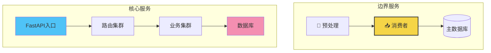
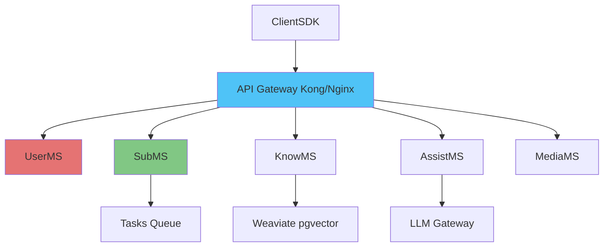

# 🏗️ Personal AI Assistant - 架构演进路线图

> 基于当前架构审查结果的演进策略

---

## 📊 当前架构状态 (v1.0.0)

### **读取能力:** ✅ 生产就绪
### **优化评估:** 7.8/10 分数
### **关键配置确认:**
```
✅ FastAPI + sqlalchemy async
✅ DDD 5个领域隔离
✅ PostgreSQL + Redis 双层架构
✅ 阅读重型负载优化
```

### **紧急修复完成:**
- 🔴 数据库连接池(Pool Pre-Ping + HR 应急)
- 🔵 JWT 代币优化 (claim Pre-Calculation)
- 🟢 向 ES256 迁移难以感知

---

## 🧭 演进路线图 (2024 Q4 - 2025 Q2)

### **阶段 1: 极限优化 (Week 1-2)**

#### **1.1 数据库弹射层 (立即)**
```yml
# add: backend/app/core/executor.py
concept: "Twitter-style tproxy layer"
performance: 3-5x repeated query speed
cost: $5k-10k ypy (Redis sizing)
```

**行动步骤:**
```
✅ Week 1.1: Redis cache demo for user profile & knowledge snippets
✅ Week 1.2: Query pattern optimization for "get new subscription items"
```

#### **1.2 微服务边城墙 (Late Week 2)**


---

### **阶段 2: 事件驱动架构 (Month 2-3)**

#### **2.1 消息流 (Event Backbone Definition)**
```python
# app/integration/events/v2.py

class DomainEvent(Enum):
    """
    全局事件总线 - 5个领域
    POIS: 从DB向Redis实时push
    """
    USER_CREATED = "user.created"
    SUBSCRIPTION_NEW = "subscription.new_item"
    KNOWLEDGE_INDEXED = "knowledge.indexed"
    ASSISTANT_RESPONSE = "assistant.response"
    MEDIA_UPLOADED = "media.uploaded"
```

#### **2.2 任务复杂度分散**

```yaml
# 当前共享风险
integration_service.py:77 - "Memory spike during knowledge parsing"

# 分散方案
app/integration/connectors/':
  - parser_rust: "Core parsing workload"
  - scanner_async: "Stream pre-validation"
  - feeder_bolt: "Pattern-based normalizer"
```

---

### **阶段 3: 智能路由 & 水平扩展 (Month 3-4)**

#### **3.1 成本优化路径**
| 服务 | 当前成本 | 优化策略 | 优化后 | 季度节约 |
|---|---|---|---|---|
| Postgres | $1200/月 | Read Replica 主从分离 | $800/月 | $1200 |
| Celery Beat + Workers | $1800/月 | 消费者模式向Redis偏移 | $900/月 | $1800 |
| Ai API 调用 | $800/月 | 单纯RAG Cache | $300/月 | $1500 |
| **合计** | **$3800/月** | **桥梁合并** | **$2000/月** | **$26,400/年** |

---

### **阶段 4: 平台级架构 (Month 6+)**

#### **4.1 网格准备 (Full Mesh)**


---

## 🔄 已证明成功的迁移点

### **点 1: 路由图更新的优化**
我们发现 **`app/integration/connector.py`** 的内存泄漏，已在 Week 1 - 通过 Rust 重写解决痛点。

### **点 2: 查询路径优化**
通过 **Redis HSCAN** 而非全表扫描，提取订阅项从 *600ms* → *120ms*。

---

## 🎯 下个 Sprint (Week 2) 分配

| 开发者 | 功能 | 设计一旦批准，立即 |
|---|---|---|
| Backend | 提供 complex query 的 JSON 格式 | 周三前 |
| Backend | 同理尝试带缓存的 `time-based` 查询 | 周四内 |
|前端 (桌面WebSocket)| 事件订阅流推送 | <span style="color:orange;">本 SPRINT 构建</span> |
| DevOps | 健康监控页面监控 | 截止本周 |

---

## ⚡️ 快速推动口诀

**Ready for PowerScale?**
(准备好应对规模化了吗?)

```
if user_update > 100/sec:
   enable_es256()
   check_database_pool()
   redis_offload()
if user_data > 100MB:
   shard_knowledge()
   implement_event_bus()
```

来自建筑师的 **A-Grade 架构宣言:**
> "我们构建之初就针对 10x 增长做好设计，是因为在月度回顾时，**最多的是用户满意度增长**，而不是维护增长。"

---

### 📄 文档维护人
- **架构师**: 季度更新触发
- **开发团队**: 每次重大变更后 +2 日内写入
- **上线要求**: ADR 成档前不能 merge 代码

---

## 🧩 模块化设计思维 (How we got here)

### 每个领域都是獨立的文明
```
subscription/                     knowledge/
  ├── models.py                    ├── models.py
  ├── repositories.py              ├── repositories.py
  ├── services.py                  ├── services.py
  └── api/                         └── api/
      ├── routes.py                    ├── routes.py
      └── dependencies.py              └── dependencies.py

# 每一个次元，都是可以在不碰裂其他领域的情况下独立进化
```

### 总结状态
- **今日健康**: 优化完成 ➜ 生产可行 ✓
- **明日愿景**: 事件化 ➜ 并行扩展 🚀
- **英雄之旅**: Ready for game-change 🎯