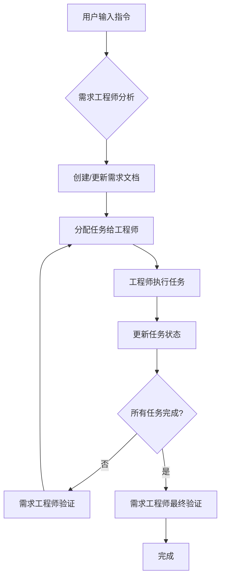

# 优化工作流程指南

## 概述

本文档定义了Personal AI Assistant项目的优化工作流程，该流程以需求工程师（产品经理）为核心，确保所有需求都经过充分分析、规范化文档化和完整验证。

## 工作流程总览



## 详细工作流程

### 阶段1：需求分析与文档化

**负责人**：需求工程师（产品经理）

**触发条件**：用户输入任何指令

**执行步骤**：

1. **需求分析**
   - 理解用户意图和目标
   - 识别功能需求和非功能需求
   - 评估与现有需求的关系

2. **需求分类**
   - **新需求**：创建全新的需求文档
   - **需求改进**：修改现有需求文档
   - **问题修复**：在现有需求文档中添加修复任务

3. **创建/更新需求文档**
   - 在`specs/`目录下创建或修改Markdown文档
   - 包含完整的用户故事和验收标准
   - 定义技术要求和约束条件
   - 列出依赖关系和风险评估

**输出**：
- 规范化的需求文档（MD格式）
- 任务清单和验收标准
- 技术规范和约束条件

### 阶段2：任务分配与执行

**负责人**：需求工程师（产品经理）协调，相应工程师执行

**执行步骤**：

1. **任务分解**
   - 将需求分解为具体的工程任务
   - 确定任务优先级和依赖关系
   - 评估工作量和时间要求

2. **工程师分配**
   - 根据任务类型分配给合适的工程师
   - Backend任务 → Backend Developer
   - Frontend任务 → Frontend Developer
   - Mobile任务 → Mobile Developer
   - 架构决策 → Architect
   - 测试任务 → Test Engineer
   - 部署任务 → DevOps Engineer

3. **任务执行**
   - 工程师按照需求文档执行任务
   - 遵循编码规范和最佳实践
   - 编写必要的测试用例

**输出**：
- 代码实现
- 测试用例
- 技术文档

### 阶段3：任务状态更新

**负责人**：执行任务的工程师

**执行步骤**：

1. **标记任务完成**
   - 在需求文档中更新任务状态为"已完成"
   - 添加完成时间戳和简要说明
   - 附上相关代码和测试链接

2. **更新进度**
   - 标记已完成的验收标准
   - 记录遇到的问题和解决方案
   - 更新剩余任务列表

**输出**：
- 更新的需求文档
- 任务完成记录
- 问题解决方案文档

### 阶段4：验证与迭代

**负责人**：需求工程师（产品经理）

**执行步骤**：

1. **任务验证**
   - 检查所有任务是否真正完成
   - 验证是否满足所有验收标准
   - 进行功能测试和集成测试

2. **问题识别**
   - 如发现问题，标记相应任务
   - 创建修复任务并分配给工程师
   - 回到阶段2重新执行

3. **最终验收**
   - 确认所有需求已实现
   - 验证整体功能完整性
   - 获得用户确认

**输出**：
- 验证报告
- 问题修复记录
- 最终交付物

## 文档结构规范

### Specs目录结构

```
specs/
├── active/                     # 活跃需求
│   ├── user-management/        # 用户管理模块
│   │   ├── requirement.md      # 需求文档
│   │   ├── tasks.md           # 任务分解
│   │   └── verification.md    # 验证报告
│   ├── knowledge-base/        # 知识库模块
│   └── ...
├── completed/                  # 已完成需求
├── templates/                  # 文档模板
│   ├── requirement-template.md
│   ├── task-template.md
│   └── verification-template.md
└── index.md                   # 需求索引
```

### 需求文档模板

```markdown
# [需求名称]

## 基本信息
- **需求ID**: REQ-[YYYYMMDD]-[序号]
- **创建日期**: YYYY-MM-DD
- **最后更新**: YYYY-MM-DD
- **负责人**: 需求工程师
- **状态**: [Draft/Active/In Review/Completed]

## 需求描述
### 用户故事
作为 [用户角色]，我想要 [功能描述]，以便 [价值/目标]。

### 功能需求
- [ ] 需求1
- [ ] 需求2
- [ ] 需求3

### 非功能需求
- 性能要求：
- 安全要求：
- 可用性要求：

## 任务分解
### Backend任务
- [ ] [TASK-ID] 任务描述 (负责人: Backend Dev)
  - 验收标准：
    - [ ] AC1
    - [ ] AC2

### Frontend任务
- [ ] [TASK-ID] 任务描述 (负责人: Frontend Dev)
  - 验收标准：
    - [ ] AC1
    - [ ] AC2

### 测试任务
- [ ] [TASK-ID] 测试计划 (负责人: Test Engineer)
  - 测试用例：
    - [ ] TC1
    - [ ] TC2

## 验收标准
### 整体验收
- [ ] 所有功能正常工作
- [ ] 性能指标达标
- [ ] 用户验收通过

## 变更记录
| 日期 | 变更内容 | 变更人 |
|------|----------|--------|
| YYYY-MM-DD | 初始创建 | [姓名] |
```

## 角色与职责

### 需求工程师（产品经理）
- **主要职责**：
  - 分析和澄清用户需求
  - 创建和维护需求文档
  - 协调各工程师的工作
  - 验证功能完整性

- **工作产出**：
  - 需求规格说明书
  - 任务分解文档
  - 验收测试计划

### 各类工程师
- **共同职责**：
  - 按需求文档完成任务
  - 更新任务状态
  - 编写测试用例
  - 文档化实现细节

- **特定职责**：
  - **Backend Developer**: API开发、数据库设计、业务逻辑实现
  - **Frontend Developer**: UI开发、用户交互、响应式设计
  - **Mobile Developer**: 移动端适配、原生功能集成
  - **Architect**: 系统设计、技术选型、架构决策
  - **Test Engineer**: 测试策略、自动化测试、质量保证
  - **DevOps Engineer**: 部署流程、CI/CD、基础设施管理

## 工具集成

### 自动化工具
- **需求追踪**：通过Markdown文档版本控制
- **任务分配**：基于文档中的@提及
- **进度跟踪**：通过Git提交和PR关联
- **自动化验证**：CI/CD流水线集成

### 协作流程
1. **需求创建** → 创建新的分支和PR
2. **任务分配** → 在PR中@相关人员
3. **进度更新** → 提交代码并更新文档
4. **验证完成** → PR审核和合并

## 质量保证

### 定义完成（Definition of Done）
- [ ] 需求文档完整且已评审
- [ ] 所有任务已实现并测试
- [ ] 代码已通过Code Review
- [ ] 文档已更新
- [ ] 验收测试已通过
- [ ] 用户已验收

### 质量门禁
- **需求阶段**：必须包含完整的用户故事和验收标准
- **开发阶段**：必须通过所有单元测试和集成测试
- **验证阶段**：必须通过端到端测试和用户验收测试

## 异常处理

### 需求变更
- 识别变更影响范围
- 评估变更成本和风险
- 更新需求文档并通知相关方
- 重新评估任务分解

### 任务延期
- 及时上报延期原因
- 调整任务优先级
- 分配额外资源或调整时间线
- 更新项目计划

### 质量问题
- 立即停止相关任务
- 分析问题根因
- 制定修复方案
- 重新验证修复效果

## 持续改进

### 流程优化
- 定期评审工作流程
- 收集团队反馈
- 识别瓶颈和改进点
- 更新流程文档

### 知识积累
- 维护最佳实践库
- 总结经验教训
- 分享成功案例
- 培训新团队成员

## 附录

### 快速参考

| 场景 | 负责人 | 关键步骤 |
|------|--------|----------|
| 新功能需求 | 需求工程师 | 分析→文档→分配→验证 |
| Bug修复 | 需求工程师 | 复现→分配→修复→验证 |
| 需求变更 | 需求工程师 | 评估→更新→沟通→实施 |

### 常用命令

```bash
# 创建新需求
mkdir -p specs/active/feature-name
cp specs/templates/requirement-template.md specs/active/feature-name/requirement.md

# 更新任务状态
git add specs/active/feature-name/requirement.md
git commit -m "Update task status: TASK-001 completed"

# 查看活跃需求
ls specs/active/
```

### 联系信息

- **需求工程师**：[联系方式]
- **技术负责人**：[联系方式]
- **项目经理**：[联系方式]

---

*本文档是工作流程的核心指南，所有团队成员应严格遵守并在实践中持续改进。*